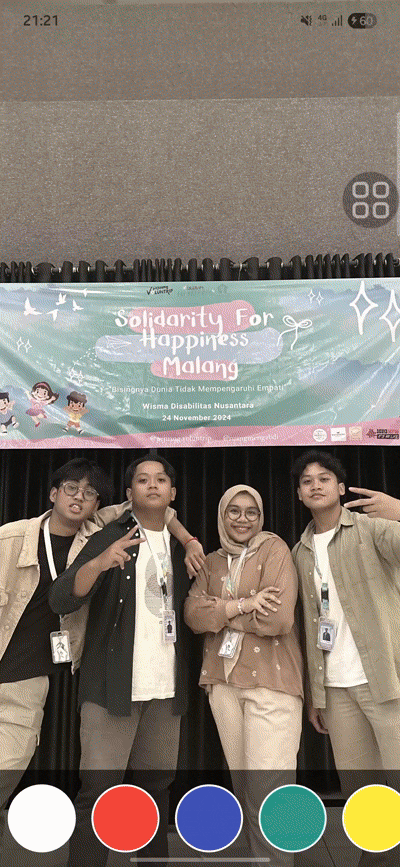
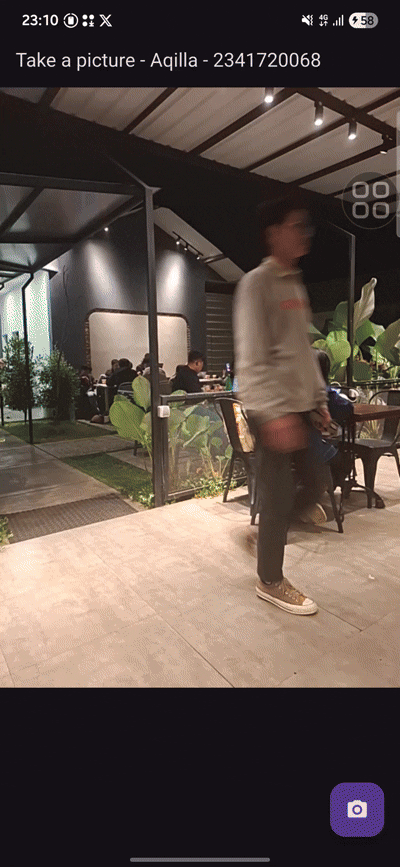

# PRACTICAL ASSIGMENT 
## 1. Complete Practicals 1 and 2, then document and upload screenshots of each work result along with explanations in a file README.md! If there are any errors or code that doesn't work, please correct them according to the application's purpose!
### PRACTICAL 1 

  

In Practical 1, the task was to implement a camera feature using the camera package in Flutter. The app allows users to take a photo using the device’s camera.

### PRACTICAL 2 

  

In Practical 2, the task extended the functionality by integrating a filter carousel, enabling users to preview and apply filters to the photo taken.

## 2. Combine the results of lab 1 with the results of lab 2 so that after taking the photo, you can create a carousel filter!

  

After combining both practicals, the app flow becomes:
* Open the camera and take a picture.
* The captured photo is passed to the FilterCarouselPage, where users can swipe through filters.

## 3. ExpLain the purpose void asyncof practical 1?
In Flutter, async allows a function to perform asynchronous operations without blocking the main thread.
In Practical 1, the async keyword is used in functions like _initializeCamera() or _takePicture() to:

* Await camera initialization before proceeding.
* Wait for the photo capture to complete before navigating to the next page.
This ensures smooth performance and prevents UI freezing while waiting for camera operations.

## 4. Explain the function of annotation @immutableand @override?
* @immutable:
This annotation indicates that a class’s fields cannot be changed after initialization.
It is typically used in Flutter widgets (especially StatelessWidget) to promote immutability and prevent unintended side effects.

* @override:
This annotation tells the Dart compiler that a method overrides a method from a parent class.
It improves code readability and ensures the method signature matches the parent method correctly (e.g., @override Widget build(BuildContext context)).

## 5. Submit your GitHub repository commit link to the agreed lecturer!
